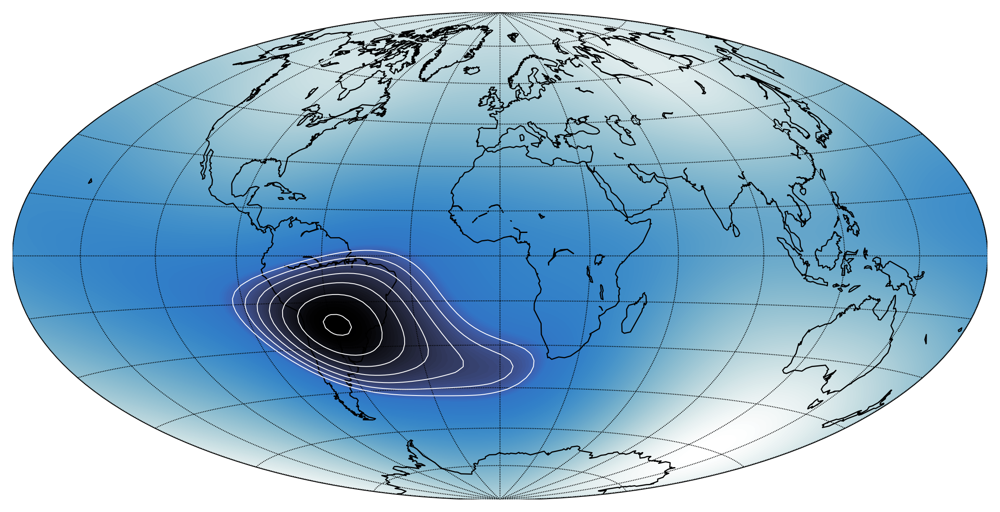

# Plotting the South Atlantic Anomaly with matplotlib and pygeomag

```python
import cmasher as cmr
from mpl_toolkits.basemap import Basemap
import numpy as np
import matplotlib.colors as colors
import matplotlib.pyplot as plt
from pygeomag import GeoMag


lat = np.linspace(-90, 90, int(180/2))
lon = np.linspace(-180,180, int(360/2))
lats, lons = np.meshgrid(lat, lon)

mag = np.zeros_like(lats)

gm = GeoMag()
for ix, iy in np.ndindex(lats.shape):
    mag[ix, iy] = gm.calculate(glat=lats[ix, iy], glon=lons[ix, iy],
                               alt=500, time=2020.0).f

# don't draw contours for values above 22000 nT
contour_max = 22000
mag_contour = mag.copy()
mag_contour[mag_contour > contour_max] = contour_max

fig, ax = plt.subplots(figsize=(10,6))
m = Basemap(projection='hammer', resolution='c', lon_0=0, ax=ax)
m.drawcoastlines(linewidth=0.66)

m.drawparallels(np.arange(-90, 105, 15), linewidth=0.5)
m.drawmeridians(np.arange(0, 390, 30), linewidth=0.5)

offsetnorm = colors.TwoSlopeNorm(vmin=np.min(mag),
                                 vcenter=contour_max,
                                 vmax=np.max(mag))

# draw filled contours as background
c = m.contourf(x=lons, y=lats, data=mag, latlon=True,
               levels=500, cmap='cmr.arctic', norm=offsetnorm)

# draw individual contour lines
m.contour(x=lons, y=lats, data=mag_contour, latlon=True,
          levels=7, colors='w', linewidths=0.5)
```


